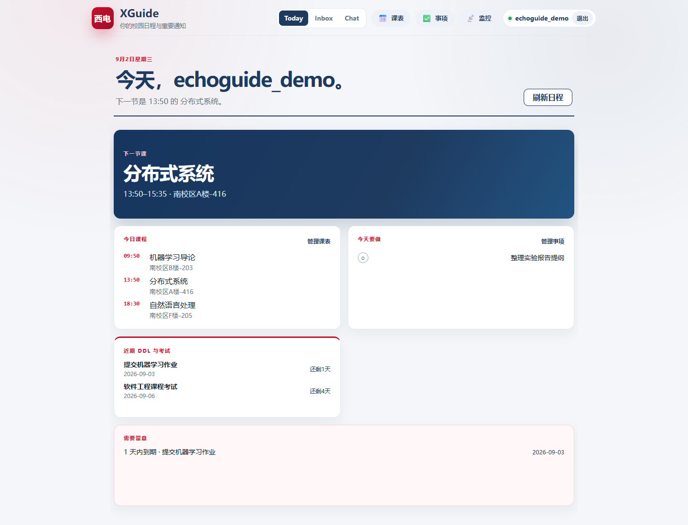
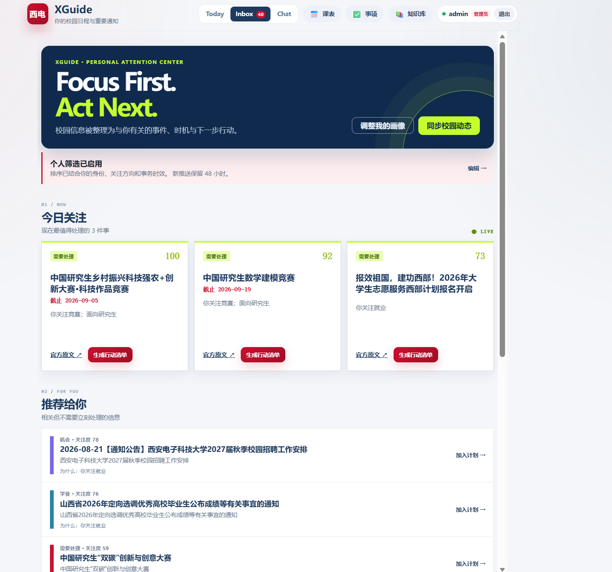

# XGuide

### 让每一条校园通知，变成你下一步能完成的行动。

**校园个人 Agent · Today · Inbox · Chat**

[快速开始](#快速开始) · [产品能力](#从通知到行动) · [技术设计](docs/architecture.md) · [API 文档](docs/api.md)

> 许多校园信息停留在“你看过了”。XGuide 把公开通知、你的课表、待办、DDL 和考试放进同一条可执行链路：知道今天该做什么，理解通知为什么与你有关，并把有依据的下一步真正记下来。

XGuide 是一个面向高校学生的全栈开源项目。它不接入教务系统，也不把用户画像发送给校园网站；现阶段只基于用户主动导入的数据与无需登录的校园公开信息工作。

## 从通知到行动

~~~mermaid
flowchart LR
    A[公开校园通知] --> B[Campus Radar]
    B --> C[可溯源的 Campus Event]
    C --> D[Inbox：个人注意力中心]
    D --> E[原文有据的 Action Plan]
    E --> F[Today：课表、待办与提醒]
    F --> G[Chat：自然语言协助]
~~~

| Today | Inbox | Chat |
|:---:|:---:|:---:|
| 下一节课、今日事项、未来 7 天 DDL/考试和临近提醒。 | 把公开通知聚合为事件，按身份、兴趣、时效与事项类型呈现“今日关注 / 推荐 / 分类浏览”。 | 用自然语言查询课表、校园信息与知识库；复杂请求可拆分为受权限约束的任务。 |
| 用户导入课表、管理待办即可开始。 | 官方原文、推荐原因、关注度构成与通知时间线都可回看；可忽略或从个人 Inbox 移除。 | 运行轨迹、工具调用与证据可在调试模式查看。 |

### Inbox：不是通知流，而是个人注意力中心

~~~mermaid
flowchart LR
    A[公开官网通知] --> B[增量同步与原文留存]
    B --> C[同主题通知聚合]
    C --> D[画像匹配 + 时效评分]
    D --> E[今日关注 / 推荐 / 分类浏览]
    E --> F[加入个人计划]
~~~

- **先保留事实，再给出判断**：通知以来源、原文链接和时间线为锚点；相同主题的多条通知只在界面上聚合，仍可逐条回到官方页面核验。
- **不是“默认空白”的个性化**：未完善画像时，Inbox 会展示最近 24 小时同步到的公开通知；设置学历或关注方向后，再按匹配度、截止日期、事项重要性和兴趣关联排序。
- **只在该出现时出现**：已过截止日的事件不会再次投递；新进入个人 Inbox 的通知默认保留 48 小时。移除通知只影响当前用户的收件箱，不会删除公共来源记录。

**行动计划不编造。** 只有通知原文中可核验的材料、动作和截止日期才会进入个人计划；信息不足时，系统只生成保守事项并标记证据范围。

## 真实运行链路

<table>
<tr>
<td width="50%" align="center"><strong>Today · 一页看清今天</strong></td>
<td width="50%" align="center"><strong>Inbox · 个人注意力中心</strong></td>
</tr>
<tr>
<td></td>
<td></td>
</tr>
<tr>
<td width="50%" align="center"><strong>Chat · Fast 个人课表查询</strong></td>
<td width="50%" align="center"><strong>Chat · 多任务依赖 DAG 执行</strong></td>
</tr>
<tr>
<td></td>
<td></td>
</tr>
</table>

这四个场景按“今天要做什么 → 哪些校园事值得关注 → 快速查询 → 复杂任务执行”排列。截图由 Playwright 驱动真实页面和后端生成；Today 截图中的课程、待办、DDL 与考试仅为采集时写入演示账户的数据，截图完成后已清理。访问产品页时附加 <code>?debug=1</code>，可查看 Profile、分类阶段、工具、DAG、Token 与 Trace ID。

## 快速开始

### 使用 Docker Compose（推荐）

准备 Docker Desktop、模型 API Key，以及仓库根目录的环境配置：

~~~powershell
git clone https://github.com/iam-epiphany/XGuide.git
Set-Location XGuide
Copy-Item .env.example .env
# 编辑 .env：至少填写 ANTHROPIC_API_KEY；生产环境还必须设置 JWT_SECRET_KEY
docker compose up -d --build
~~~

打开：

- 产品入口：<http://localhost:8088>
- 后端 API 文档：<http://localhost:8100/docs>
- 健康检查：<http://localhost:8100/health>

Compose 会启动 XGuide、Redis、ChromaDB、Prometheus 与 Nginx。查看状态可执行 <code>docker compose ps</code>。

### 本地开发

后端和前端分别在两个 PowerShell 终端运行：

~~~powershell
# 终端 1：后端
Set-Location 'D:\Agent-Project\XGuide'
.\.venv\Scripts\python.exe -m pip install -r requirements.txt -r requirements-dev.txt
$env:ECHOGUIDE_SERVE_STATIC='0'
.\.venv\Scripts\python.exe -m api.main
~~~

~~~powershell
# 终端 2：前端热更新
Set-Location 'D:\Agent-Project\XGuide\frontend'
npm install
$env:VITE_PYTHON_API_URL='http://localhost:8100'
npm run dev
~~~

前端开发入口为 <http://localhost:5175>。本地模式需要 Redis；最快方式是执行：

~~~powershell
docker run -d --name echoguide-redis -p 6379:6379 redis:7-alpine redis-server --requirepass echoguide123
~~~

更多环境变量、部署细节和截图复现方式见 [运行说明](docs/architecture.md) 与 [前端说明](frontend/README.md)。

## 为什么是 XGuide

<table>
<tr>
<td width="50%">

### 产品侧：少一点信息焦虑

- 把“通知”转为可排进日程的事情，而不是再造一个信息流。
- 通知与个人课表、待办、DDL、考试同屏汇总。
- 将同主题通知合并为一个可判断的事件，避免同一件事反复打扰。
- 官方来源、推荐原因、关注度构成与生成事项都可以回溯。

</td>
<td width="50%">

### 工程侧：让 Agent 可控

- Fast / Deep 双路径与 Task-scoped Agent。
- L0–L3 分层记忆，保留原始证据链。
- Agentic RAG：查询改写、并行召回、重排、句级引用。
- Trace、指标、Verifier 与工具读写门禁。

</td>
</tr>
</table>

## 技术栈

| 层 | 选型 | 作用 |
|---|---|---|
| Web | Vue 3 · Vite | 学生端 Today / Inbox / Chat |
| API | FastAPI · Uvicorn | REST、SSE、认证与同源静态托管 |
| Agent Runtime | 自研 Harness · DeepSeek Anthropic-compatible API | 意图识别、规划、TaskAgent、校验与可观测 |
| 数据 | SQLite · Redis · ChromaDB | 个人数据、工作记忆、长期/向量记忆 |
| Retrieval | BGE Embedding · BGE Reranker | 中文知识检索、重排与 Grounding |
| 运维 | Docker Compose · Nginx · Prometheus | 一键运行、统一入口和指标观测 |

## 核心设计

<strong>展开查看 Agent Runtime 设计</strong>

 

- **任务边界**：每个 Task 有独立目标、领域、动作、依赖与最小工具集；复合请求以 DAG 分波执行。
- **最小权限**：可用工具 = Agent 暴露工具 ∩ action 策略 ∩ Task 能力。非写请求不会获得写工具。
- **证据优先**：需要知识支撑的回答自动预检索；无对应证据的裸引用会被剥离或标记。
- **有限反馈**：Fast Profile 的在线表现不健康时可临时升级 Deep，恢复后自动回落。
- **失败可解释**：Trace 记录 request → intent → planner → task → tool → LLM，Verifier 只标注不阻断。

<strong>展开查看 Campus Radar 与行动计划设计</strong>

 

- **采集与个性化分离**：Adapter 只访问无需登录的公开网页；事件落库后才在本地结合学生画像排序，画像和认证信息不会随请求发往校园网站。
- **增量而非重复抓取**：以 ETag、Last-Modified 和内容哈希识别未变更、更新与新增通知；单条通知读取失败不会中断同一来源的其他同步任务。
- **事件而非信息堆积**：根据明确的主题信号和截止日期确定性聚合，输出可解释的关注度与时间线；这不是黑箱聚类，也不改写原始通知。
- **计划有证据边界**：材料先转为准备事项，明确动作转为待办，带截止日期的最后一步才成为 DDL；每项均保留来源事件与官方链接。

详细架构图、数据模型、Benchmark 口径与 API Schema：

| 文档 | 内容 |
|---|---|
| [架构设计](docs/architecture.md) | 产品闭环、Runtime、RAG、Memory 与 MCP |
| [API 文档](docs/api.md) | Today、Inbox、行动计划、对话与认证接口 |
| [数据模型](docs/database-er.md) | 个人数据、Campus Radar、分层记忆与向量存储 |
| [Benchmark 方法](docs/benchmark-methodology.md) | 场景、指标口径与复现原则 |
| [前端说明](frontend/README.md) | 前端开发、构建与部署 |

## 数据与安全边界

- **公开通知**：Campus Radar 只访问无需登录的官方网站；请求不会携带学生画像或认证 Cookie。
- **个人数据**：课表、待办、Inbox 状态与画像都按登录用户隔离。
- **Inbox 生命周期**：忽略、删除和 48 小时投递期限都只作用于个人 Inbox；公共通知与来源证据不会被个人操作改写。
- **原文约束**：行动计划仅转换已提取的原文证据，不将推测当成事实。
- **生产配置**：生产环境缺少有效 <code>JWT_SECRET_KEY</code> 会拒绝启动；密钥只保存在服务端环境变量中。

## 开发与贡献

~~~powershell
# 后端测试
.\.venv\Scripts\python.exe -m pytest tests -q

# 前端构建与依赖审计
Set-Location frontend
npm run build
npm audit --omit=dev --audit-level=high
~~~

欢迎通过 Issue 或 Pull Request 参与。提交前请确保测试、前端构建和 Docker Compose 配置检查通过。

## License

[MIT](LICENSE) © 2026 XGuide Contributors

---

产品主视觉为概念插图；功能说明与运行截图以仓库内代码和实测资产为准。
