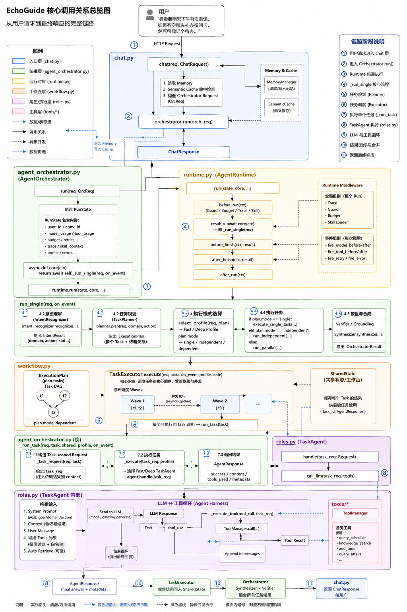
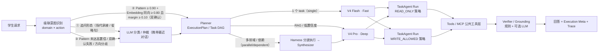
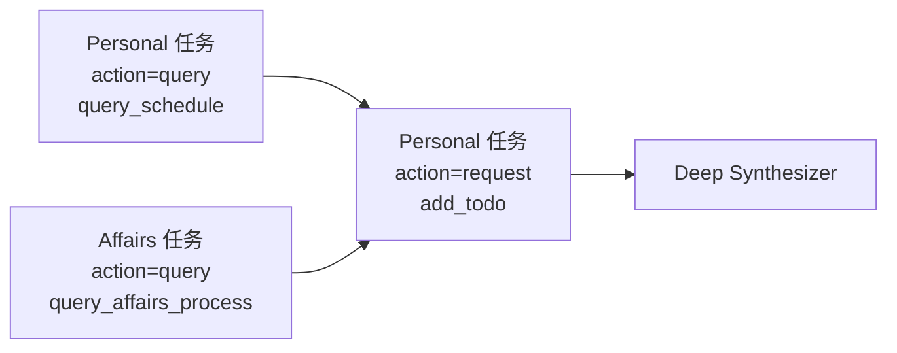

# XGuide · 校园个人 Agent

XGuide 面向高校学生，把分散在校园公开网站的通知与自己的课表、待办、DDL、考试放到同一条可执行链路中。它会发现公开通知、按学生画像筛选相关内容、保留官方来源，并将通知中有明确依据的材料与行动转成可管理的个人计划。

它解决的不是“再问一次校园新闻”，而是“今天我该做什么、这条通知和我有什么关系、下一步怎样完成”。P0 Personal Hub 不依赖教务系统；现阶段只使用用户录入/导入的数据与公开校园信息。

```text
Campus Information → Campus Radar → Structured Campus Event → Personalization
        → Agent Runtime → Action Plan → Personal Hub (Today / Reminder)
```

在这个产品闭环之下，XGuide 仍保留自研轻量 **Agent Runtime / Harness**：分层长程记忆（Working Memory + L0-L3）、级联意图识别、Agentic RAG、Monitor/Trace 可观测与 MCP 工具层；Task-scoped SubAgent、Fast/Deep 双路径、动态 Skills、工具权限、Verifier、DAG 编排和评测为上述体验提供工程支撑。

## 产品闭环：Today · Inbox · Chat

当前前端围绕三页工作，而不是把能力堆成一组独立接口：

| 页面 | 面向学生的结果 | 数据与边界 |
|---|---|---|
| **Today** | 下一节课、当天事项、未来 7 天 DDL/考试与临近提醒 | 只读取用户导入的课表和用户管理的待办，不接入教务系统 |
| **Inbox** | 按稳定学生画像排序的公开校园通知，可标记“感兴趣/忽略” | 只抓取无需登录的官方公开页面；每条通知保留原文链接 |
| **Action Plan** | 将通知原文中明确列出的材料和动作写成个人待办，最后一步可带原始截止日期 | 不补造材料、条件或步骤；没有可提取行动时仅创建以通知标题命名的保守事项 |
| **Chat** | 对个人日程、校园信息与知识库发起自然语言请求 | 继续经过 Intent、TaskAgent、工具权限、Grounding 与 Trace 链路 |

Inbox 的同步流程为：公开站点 Adapter 发现链接 → 条件请求（ETag / Last-Modified）与内容哈希去重 → 规则兜底或可选 LLM 结构化提取 → 画像相关性排序 → 用户确认后生成行动计划。抓取失败只会在同步结果中报告该来源，不影响既有个人日程；用户画像不会传递给校园网站。

## 核心架构

```text
Agent Runtime / Harness
        |
        +-- Intent（级联意图识别）
        +-- Memory（分层长程记忆 Working Memory + L0-L3）
        +-- Agentic RAG
        +-- Monitor / Trace
        +-- MCP Server
```

二级支撑能力：Task-scoped SubAgent（唯一 TaskAgent + 执行策略）、Fast / Deep 双路径、动态 Skills、工具权限（读写门禁）、Verifier / Grounding、DAG 复杂任务编排、Evaluation。

## 真实网页实测

以下截图由 Playwright 访问真实网页、登录 Demo 用户、导入动态课表、调用真实 DeepSeek 模型后自动生成；使用 `?debug=1` 展开 Profile、分类阶段、工具、DAG、Token 和 Trace ID。
### 架构图



### Fast · 个人课表


### 领域专属工具


### Deep · Agentic RAG


### 多任务依赖 DAG


### 多轮记忆与 Guard 拒绝


## Fast / Deep 双路径



| Profile | 模型 | 思考模式 | 输出预算 | RAG 策略 | 典型任务 |
|---|---|---|---:|---|---|
| Fast | `deepseek-v4-flash` | 关闭 | 768 | Top-K 3，不改写、不重排 | 课表、天气、校车、确定性工具 |
| Deep | `deepseek-v4-pro` | 开启，effort=high | 1536 | Top-K 5，查询改写 + 本地 bge 重排（LLM 兜底） | 政策问答、复杂请求、多任务 DAG |

Monitor 按 Profile（`fast` / `deep` 两档）统计成功率、平均与 P50/P95 延迟、在途请求；Fast 在线表现不健康时临时升级 Deep。两种 Profile 可以分别配置 API Key、模型和端点；每 Profile 一个执行实例（同构复制多个 TaskAgent 没有能力差异，并发由 asyncio 承担，未来接入真正异构 Model/Endpoint 时再扩展实例级路由）。

> 图中 Pattern 阈值 0.90、Embedding 阈值 0.80 / margin 0.10 为默认值（按真实 bge 分布标定：同构嵌入下命中区与 miss 区存在分离空档；宁紧勿松，有 LLM 兜底），可通过 `ECHOGUIDE_INTENT_PATTERN_THRESHOLD` / `ECHOGUIDE_INTENT_EMBEDDING_THRESHOLD` / `_MARGIN` 覆盖（见下文「本地向量模型」）。

## 五条主线

### 1. 分层长程记忆（Working Memory + L0-L3）

推荐定位：**Hierarchical Long-term Memory with Provenance**——低层保留证据、高层保留结构，任何高层结论可沿证据链逐层下钻回原始对话。Redis Working Memory 承载当前会话近期上下文，**不计入 L0-L3**。

| 层级 | 内容 | 存储 | 写入时机 |
|---|---|---|---|
| L3 Persona | 长期画像，版本历史可回滚 | ChromaDB + SQLite | 检测到背景/偏好信号时 LLM 提炼 |
| L2 Scenario | 场景块（任务/结论/关键实体） | ChromaDB `layer=scenario` | 工作记忆压缩时生成，检索优先注入 |
| L1 Atom | 结构化原子事实，带证据链；只存画像未覆盖的事实 | SQLite `facts` | 与画像提炼同一次 LLM 调用双产出 |
| L0 Raw | 原始对话全量，永不丢失 | SQLite `raw_messages` | 每条消息落库，`turn_id` 为证据锚点 |

设计要点：

- **一次提炼双产出**：画像信号触发时，一次 LLM 调用同时产出画像（L3）与原子事实（L1），零额外成本；事实带 `source_conv/source_turn` 证据链，可下钻到 L0 原文。
- **增量提炼**：`extract_marks` 水位记录上次提炼的最大轮次，信号命中只提炼水位之后的新消息 + 既有画像合并，老消息不重复喂 LLM；同会话并发提炼串行化，提炼成功才推进水位。
- **L1/L3 分工去重**：L3 画像负责聚合（偏好/实体），L1 事实负责画像之外的细粒度可溯源事实——被画像条目覆盖的事实不落 L1，同一信息不双写。
- **L1 按需召回**：上下文构建时 L3 画像常驻注入，L1 事实按当前提问按需召回（共享非停用字符 bigram 才注入）；`memory_trace.facts_total` 透出可用事实总数。
- **白盒可溯源**：高层结论 → 事实 → 原文逐层可查；`memory_trace` 把各层命中统计透出到 `execution`。
- **上下文卸载**：工具结果超过 1500 字符时完整落盘 refs 表，上下文只留摘要 + `refs/{id}` 索引，需要时 100% 找回 —— 长任务 Token 消耗显著下降。
- **治理**：画像版本化可回滚；事实失效标记（不物理删除）；`prune` 生命周期清理。

确定性离线评测（模拟数据、无 API 依赖、可重复、可入 CI）：

```bash
python evaluation/memory_benchmark.py
```

| 指标 | 结果 |
|---|---:|
| 上下文卸载（3 个长工具结果） | 9267 tokens → 591 tokens（节省 93.6%） |
| L0 原文保留 | 100%（12 轮全量落库） |
| L1 事实证据链溯源 | 100%（每条可下钻到 L0 原文） |
| refs 卸载找回 | 100%（完整结果可恢复） |
| L3 画像版本回滚 | OK（3 版可回滚到最老版） |
| 增量提炼 | 首次全量预热 OK，后续仅提炼新消息（老消息重复输入 0 条） |
| 画像提炼触发 | 仅信号句触发 LLM（模拟对话信号率 50%，普通提问不提炼） |

> Token 估算口径：中文 1 字符 ≈ 1 token、ASCII 4 字符 ≈ 1 token（相对对比用，实际消耗以模型 API usage 为准）。

### 2. 级联意图识别（领域 × 动作）与 Planner 决策闭环

意图识别产出「领域 domain × 动作 action」二维结果，职责明确分开：

- **Domain**：用于 persona 与业务上下文，**不负责工具权限、不选执行实体、不过滤 Skill**（Skill 平级发现，"顾问"而非"门卫"）；
- **Action**：决定 TaskAgent Run 的执行策略（READ_ONLY / WRITE_ALLOWED）与工具读写权限；
- **needs_knowledge**：是否需要知识检索，由 Verifier 消费（判定需要但执行链无检索证据 → 标记异常）。

**动作重定义**：`query` = 查询/咨询/分析，不产生系统状态修改（"帮我查一下课表"是 query）；`request` = 需要系统真正执行写操作或产生副作用（"帮我添加一个补办校园卡的待办"、"把这个待办标记完成"是 request）。"帮我/我要/需要/办理" 等请求句式不再直接判 request。

**复杂度判定已从意图识别移出**：Intent 只理解用户想做什么；任务拆分与依赖统一交给 Planner——Planner 输出 `ExecutionPlan`（Task DAG），`single / parallel / dependent` 由最终 DAG 自动推导（1 个 task → single；多个无依赖 task → parallel；存在 depends_on → dependent），不再由 Intent/LLM 单独分类。

级联识别策略（宁多付成本、不静默误判）：

1. **追问形态** → 直接 LLM（带最近对话，由 LLM 结合上下文裁决）；
2. **Pattern 高置信 + Embedding 双确认**（关键词 ≥0.90、Embedding 同向 ≥0.80 且 margin ≥0.10）→ 免费直返；
3. **Pattern 未达高置信、双确认失败或方向分歧** → 直接 LLM（携带最近对话；Embedding 不单独直返）。

领域关键词唯一来源在 `core/domains.py`（单一事实来源，意图识别器、编排器、API 层共用，消除旧版三处重复维护的漂移问题）。

| action | 工具权限 | Prompt 行为指引 |
|---|---|---|
| `query` | 只读/查询类工具（禁止状态修改类） | 准确查询、如实回答，不执行修改操作 |
| `request` | 写工具（受 Action + 任务级 `allowed_write_tools` 白名单约束） | 积极调用工具解决问题，按需执行操作 |
| `complaint` | 只读工具（保守） | 先识别具体问题点，再给出解决路径 |
| `greeting` / `feedback` | 原则上不开放工具 | 简洁回应，避免无意义工具调用 |
| `other` | 只读工具（保守） | 仅基于已有信息回答，不执行修改操作 |

### 3. Agentic RAG

Deep Profile 自主调用知识检索（Agent 通过 Tool 使用知识库），执行**查询改写 → 并行召回 → 去重 → 重排**完整优化链路，回答携带来源证据：

- **文档解析与 Chunk**：`/knowledge/upload` 与 `data/knowledge_docs/` 投放目录支持 txt/md/json/jsonl 与 Firecrawl anydoc 全部格式（统一转 GFM Markdown）；分块采用 Markdown 结构感知策略（标题链注入块首、标题边界成块、表格/代码块整体保留），500 字/60 overlap；扫描件（无文本层 PDF）明确报错，不做 OCR。
- **BGE Embedding**：本地 `bge-small-zh-v1.5`（ONNX，中文优化），进程内轻量推理，替代 ChromaDB 内置英文模型；模型不可用自动回退 MiniLM 空间并重嵌入迁移。
- **查询改写**：LLM 把原始查询扩写成多角度子查询，解决"召回不全"。
- **Rerank**：本地 `bge-reranker-base` cross-encoder 打分（毫秒级、零 token 成本），不可用自动降级 LLM；打分输入为「标题+正文」文本对（避免 JSON 元数据噪声），`min_signal=0.7` 高置信门禁——重排无判别信号（如"补办"vs"办理"近义改写超出小模型能力）时弃权保持召回顺序，保证重排档不劣化。
- **Grounding 链路（retrieval-first + sentence-level citation）**：知识类请求由 Harness 自动预检索一次并注入编号证据（不依赖模型自觉调用工具）；回答生成后按句匹配证据（字符 Dice + bge 余弦），支持的句子追加 `[i]` 引用、末尾列出"可核验来源"（标题/URL/更新时间）——引用正确性由执行层保证，无证据时剥掉裸引用。
- **评测**：HitRate@K / Recall@K / MRR / 引用正确率（`evaluation/`）。

```bash
python evaluation/compare_embedders.py             # 旧 MiniLM vs 新 bge：HitRate@K / Recall@K / MRR
python evaluation/calibrate_intent_thresholds.py   # 按 bge 分数分布重标定意图识别阈值
```

### 4. Monitor / Trace / 可观测

Monitor 的目标是**可观测 + 有限反馈**，不是自动运维平台：

- 请求 Trace（`core/tracing.py`）：request → intent → planner → task（`task_execute`，含 task_id/domain/action/depends_on）→ agent → tool → LLM 逐跳耗时，`/traces/{id}` 可查，`X-Trace-Id` 响应头；
- Profile / Tool / Model 调用统计：成功率、平均与 P50/P95 延迟、在途请求、熔断状态（每 Profile 单执行实例）；
- latency / token / tool success-error 计数（ModelGateway 在每次真实模型调用时落 RunState）；
- Task 状态与 DAG blocked/failed 数量、Runtime 模型/工具调用与降级次数、Verifier flags（`orchestrator.observability_counts()` 聚合，真实业务/执行维度）；
- 简单异常检测：Z-score 告警（成功率/延迟/熔断）去重与恢复，可推 Webhook；
- **Profile 级有限反馈**：Fast 成功率显著偏低（样本 ≥10 且 <0.85）时，Monitor 标记 Fast 不健康，Orchestrator 临时把本应走 Fast 的请求升级 Deep，恢复后自动回落。

不做实例级 routing penalty（同构实例无路由意义），不扩展 RL / Bandit、自动 Prompt 优化、自动参数搜索、复杂在线学习。

Prometheus 指标入口 `/metrics`（只读无认证，指标不含敏感数据；生产经网络层限制暴露面），`config/alerts/` 提供告警规则。

### 5. MCP Server

XGuide 内部 Tool Registry 通过标准 MCP 接口对外提供服务（Streamable HTTP，tools 子集）：

- `initialize` / `tools/list` / `tools/call`，JSON-RPC 2.0；
- Tool schema 映射（JSON Schema ↔ MCP inputSchema）；
- 错误处理（Parse error / Method not found / 非法 UTF-8 → 标准 JSON-RPC 错误码）；
- 只暴露允许公开的工具：未登录客户端只能用公开工具，个人工具拒绝访问；
- 浏览器与 MCP 共用签名登录 Cookie。

外部 MCP Client（`mcp/external_client.py`，把远程 MCP server 工具拉进来）**默认关闭**，作为 optional integration / example（见下文「外部 MCP 工具源」），不是核心架构的一部分。

## Agent Runtime（Harness 收口）

模型之外的整套控制面统一收口为 `runtime/` 一层（`Agent = Model + Harness` 的 Harness）：

| 组件 | 职责 |
|---|---|
| `RunState` | 单次运行状态：身份、trace_id、step/tool/tool_round/retry 计数器、input/output tokens 累计、错误记录、middleware 扩展位 |
| `ExecutionPolicy` | 执行预算：协作目标上限、任务 DAG 上限、工具轮次（Fast/Deep 分级 3/5）+ 无进展检测（连续 N 轮同名同参工具调用强制收尾）、模型调用次数上限、工具调用总数、降级次数、合成 token、Runtime Guard、Verifier LLM 开关 |
| `RuntimeMiddleware` | 生命周期钩子（before/after × run/model/tool/finish）；before 正序、拦截异常短路，after 逆序必执行 |
| `ModelGateway` | **统一模型调用入口**：意图识别、Agent 工具循环、合成器、出口校验、记忆提炼、查询改写/重排兜底的 LLM 调用全部经 `gateway.call()/call_stream()` 进出 |
| `AgentRuntime` | 运行入口：`run(state, core)` 在中间件链内执行编排器核心；Guard 拦截时 core 不执行、返回拒绝结果 |

默认中间件链：`TraceMiddleware` → `GuardMiddleware`（消息长度 + Prompt 注入检测）→ `BudgetMiddleware`（step/tool 计数）→ `SkillMiddleware`（按消息指纹解析并缓存）。

真实执行边界：模型级钩子由 ModelGateway 在**每次真实模型调用**时触发（一次 `agent.handle()` 内部 LLM→Tool→LLM 的三次调用，`step_count` 记 3、token 逐次累加）；`BaseAgent._execute_tool` 在工具调用前后触发 `before_tool/after_tool`；Fast→Deep 降级受 `policy.max_retries` 约束。预算配置可通过 `ECHOGUIDE_RUNTIME_*` 环境变量覆盖。

```bash
python -m pytest tests/test_runtime.py -q   # Runtime 离线测试（无服务依赖）
```

## Task 边界与工具权限

真正的 Agent 单位是 **Task**（Task-scoped SubAgent）：每个 Task 由一次独立 TaskAgent Run 执行，拥有独立 goal / message / domain / action / depends_on / allowed_tools 与协作上下文。执行体只有唯一一个 Agent 类 `TaskAgent`（`agents/roles.py`），每 Profile 一个执行实例（Fast/Deep 是真实执行配置：模型/思考/预算/检索深度不同，不是复制对象）；**QA / Executor 降级为执行策略**（`roles.write_policy_for`）：

| 执行策略（WritePolicy） | 工具面 | 行为规范 | 选择依据 |
|---|---|---|---|
| **READ_ONLY** | 公共工具层 − 写工具 | 政策先检索、回答带引用、不编造 | 除 `request` 外的所有动作（含动作未知，防御纵深） |
| **WRITE_ALLOWED** | 公共工具层 ∩ 任务能力（含写） | 写操作回执、失败如实说明 | `request` 动作（Task 自己的 action） |

工具可见性 / 执行权限 = **Agent-exposed Tools ∩ Action Policy ∩ Task Capability**（四层门禁交集，暴露层与执行层双重校验）：

1. **注册级**：`Tool.agent_exposed` + 显式副作用声明 `Tool.effect`（`Tool.is_agent_visible`；外部工具默认不可见，未声明 effect 直接不可见不可写——fail-closed）；
2. **Run 级**：非 `request` 动作一律 READ_ONLY（`roles.write_policy_for`），动作未知/误判也不会暴露写工具（防御纵深）；
3. **Action 级**：QUERY/GREETING 等动作拒写（`persona.action_allows_tool`）；
4. **Task 级**：`Task.allowed_tools`（Planner 声明的任务最小权限）——"添加待办"任务只给 `add_todo`，不因 REQUEST 获得其他写工具。

**写工具集合由工具自身的 `effect` 声明推导**（`ToolEffect.WRITE` / `EXTERNAL_SIDE_EFFECT` → `MCPToolManager.write_tools()`），不再手工维护黑名单——新增有副作用的工具忘记声明 effect 时只影响它自己（不可见、不可写），不会出现"新增写工具忘记登记被只读动作误开放"。

## 动态 Skills（Runtime 扩展机制）

五类校园 SOP（academic / campus_life / affairs / it_help / personal）可热加载，作为 Runtime 的扩展机制：

- **渐进披露**：默认只给模型 Skill catalog / metadata（name + description + 触发词），真正需要时经 `use_skill_*` 工具在工具循环内加载完整 SKILL.md（Claude Code 式渐进披露，正文不进系统提示避免截断与膨胀）；
- 关键词免费高亮引导，追问继承沿用对话历史；
- 完整 SKILL.md 由模型按需加载，正文不驻留系统提示。

不继续扩展 Skill marketplace / dependency graph / self-generation / Skill Agent / 自动评测系统。

## Verifier / Grounding（Post-response Consistency Check）

定位：回答返回用户前的**出口一致性 / 依据检查**——只标注不阻断（honest-by-design），不承诺"消灭幻觉"。重点检查：

- **引用存在性**：回答出现 `[n]` 引用但无对应 retrieval evidence → flag；
- **写操作落账**：声称"已添加/已完成"但无成功的 write tool execution → flag；
- **检索需求闭环**：意图判定 `needs_knowledge=true` 但最终执行链未出现 retrieval evidence → `expected_retrieval_missing` flag（提示 RAG 链路未落地，只标注不阻断）；
- **LLM 判定（可选，`ECHOGUIDE_RUNTIME_VERIFIER_LLM=1`）**：仅 DEEP/执行路径付一次廉价 Fast 模型调用，判断回答是否被工具证据支撑；不通过追加免责声明，异常 fail-open 不阻断。

校验只标注不阻断（honest-by-design）：flags 进 `execution.verification` 与 `/health` 的 `verification` 计数。不再做日期/时间/电话/金额等易误报的硬事实正则校验。

```bash
python -m pytest tests/test_verifier.py -q   # 规则校验 / LLM 判定 / 编排器集成离线测试
```

## 复杂任务编排（ExecutionPlan / DAG）

Planner 统一输出 `ExecutionPlan`（Task DAG），复杂度模式由最终 DAG 自动推导，不再由 Intent/LLM 单独分类；确定性规则链（如下面的课表→办理信息→待办）只是**高频业务场景 Fast Path**——只有高频、稳定、确定性强、用规则明显比 LLM 更可靠的场景才加规则，通用复杂请求由 LLM 规划负责：

- `single`：1 个 task，单 Agent 直接执行（1 次 TaskAgent Run）；
- `parallel`：多个无依赖 task 并行（"食堂几点关门，顺便查下明天课表"）；
- `dependent`：存在 depends_on 的任务（"明天下午有空就去办校园卡，记个待办"）——按 depends_on 分波并行执行，依赖任务只注入声明的 `depends_on` 结果（SharedState 快照），Synthesizer 合并最终回复（LLM 失败降级规则拼接）。

**每个 Task 有自己的 action 与工具能力**：复合请求拆分后 t1/t2 可能是 `query`（READ_ONLY）、t3 才是 `request`（WRITE_ALLOWED，且只声明 `allowed_tools=["add_todo"]`）——执行策略与最小权限由任务自己决定，不再继承原始请求的 action；QUERY+REQUEST 混合等子任务权限不同的请求优先升级 LLM 规划，Planner 输出后仍有硬校验。

**DAG 失败传播**：任务状态区分 SUCCESS / FAILED / BLOCKED / SKIPPED。依赖任务 FAILED/BLOCKED → 下游任务 BLOCKED（不执行、不注入失败上下文），不能因为前置"执行完成（但失败）"就继续执行依赖任务。



DAG 每个任务由一次独立 TaskAgent Run 执行（独立 goal / message / 协作上下文 / 工具权限 / Trace），任务只读取自己声明的 `depends_on` 结果（SharedState 不做全量历史注入，避免上下文膨胀）；领域值只做 goal/人格语境键（Skill 平级发现），不构成 Agent 身份。依赖缺失或出现循环时直接失败并记录计划错误，不会绕过 DAG 执行。不增加 Supervisor / Critic / Reflection / Debate / Swarm / Agent 间复杂通信协议。

## 外部 MCP 工具源（默认关闭，optional）

把远程 MCP server（如 GitHub 官方 remote MCP server）的工具作为**工具源**接入，与 `mcp/protocol.py` 的服务端对称：用 httpx 手写极简 Streamable HTTP 客户端（零新依赖）把外部工具拉进来，包装成 `Tool` 注册进工具管理器——自动获得熔断、超时、降级、缓存与上下文卸载等既有工程能力。

接入策略（全链路降级哲学）：

- **默认只读（宁紧勿松）**：只读命名白名单（`get_*`/`list_*`/`search_*`/`query_*`/`fetch_*`/`read_*` 前缀及 `*_read` 后缀）直接放行；写关键词黑名单（create/update/delete/write/push/fork/run 等）直接拒绝；
- **前缀隔离**：外部工具以 `github_*` 前缀注册，避免与本地工具重名冲突；
- **双重不可见 → 公共工具层**：注册的工具默认 `agent_exposed=False`；`ECHOGUIDE_EXTERNAL_MCP_EXPOSE_AGENTS` 非空时加入公共工具层，写操作仍受 Action 读写门禁；
- **失败降级**：连接失败/超时/鉴权失败只记日志，服务照常启动。

```dotenv
ECHOGUIDE_EXTERNAL_MCP_ENABLED=1
ECHOGUIDE_EXTERNAL_MCP_URL=https://api.githubcopilot.com/mcp/   # GitHub 官方 remote server
ECHOGUIDE_EXTERNAL_MCP_TOKEN=github_pat_xxx                      # 服务端持有，绝不写入前端
ECHOGUIDE_EXTERNAL_MCP_PREFIX=github
# ECHOGUIDE_EXTERNAL_MCP_PROXY=http://127.0.0.1:7897            # 国内网络不通时走代理
# ECHOGUIDE_EXTERNAL_MCP_TOOL_WHITELIST=                         # 只注册名单内工具（空 = 只读过滤）
# ECHOGUIDE_EXTERNAL_MCP_EXPOSE_AGENTS=1                         # 非空 = 加入公共工具层（空 = 不暴露）
```

## 语义缓存（默认关闭，不属核心能力）

上下文相关回答做 Semantic Cache 很容易错误复用，且不属于五条技术主线，因此**默认关闭**（`SEMANTIC_CACHE_ENABLED=0`），代码保留（GPTCache 思路的双层隔离实现，见 `mcp/semantic_cache.py`），需要时显式开启。确定性的 Tool 结果仍走 `MCPToolManager` 的 TTL 精确缓存（主链路不受影响）。

## 真实 Benchmark

Benchmark 使用 28 个版本化 HTTP 场景与 10 条独立 RAG 探针，覆盖五个领域、上下文追问（LLM 结合历史分类）、Fast/Deep 路由、专属工具、RAG、多任务 DAG 和 Guard。专属工具、DAG、引用等细分指标均显示独立场景数 n；结果按实测记录，不以预设准确率反向挑选用例。默认每个场景运行三次，并与 Always-LLM + Always-Deep 基线比较。

<!-- BENCHMARK:START -->
> 实测时间：2026-08-21 00:38:08 +0800 · Commit `8927fb8-dirty` · 每场景重复 1 次
> 版本化 HTTP 场景：28 个；RAG 探针：10 条。指标后的 n 为独立场景数。

| 指标 | 自适应链路 | Always-LLM + Always-Deep 基线 |
|---|---:|---:|
| 用例通过率 | 96.4% | 0.0% |
| 领域准确率 | 96.2% | 0.0% |
| 领域 Macro-F1 | 96.2% | 0.0% |
| LLM 分类调用率 | 84.6% | 0.0% |
| Profile 路由准确率 | 100.0% | 0.0% |
| Fast→Deep 运行时降级率 | 0.0% | 0.0% |
| 复杂度 Precision / Recall | 100.0% / 100.0% | 0.0% / 0.0% |
| 专属工具成功率（n=9） | 100.0% | 0.0% |
| DAG 任务成功率（n=3） | 100.0% | 0.0% |
| RAG HitRate@5 / Recall@5 / MRR（n=10） | 100.0% / 95.0% / 0.84 | — |
| 引用正确率（n=2） | 100.0% | 0.0% |
| P50 延迟 | 7594 ms | 0 ms |
| P95 延迟 | 83517 ms | 0 ms |
| 输入 / 输出 Token | 240265 / 30325 | 0 / 0 |

> 消融：专属工具成功率 100.0%，改用通用 RAG 后为 0.0%；依赖 DAG 成功率 100.0%，强制单 Agent 后为 0.0%。
<!-- BENCHMARK:END -->

完整机器可读结果保存在 [`assets/readme/demo-metrics.json`](../assets/readme/demo-metrics.json)。报告记录时间、Git commit、模型、逐场景检查和失败信息，不隐藏不利结果。

## 快速启动

### 1. 配置

```powershell
Copy-Item .env.example .env
# 编辑 .env，填写 ANTHROPIC_API_KEY
# 本地向量模型（bge Embedding / Rerank）首次运行自动下载到
# ECHOGUIDE_MODEL_CACHE_DIR（Docker 镜像构建时已预下载，无需手动操作）
# 天气查询：默认 Open-Meteo（境外免 Key，国内可能不通）；建议在 dev.qweather.com
# 注册免费订阅并填写 QWEATHER_API_KEY，即自动切换为和风天气主源（失败时回退 Open-Meteo）
```

生产环境（`APP_ENV=production`）**必须设置 `JWT_SECRET_KEY`**（会话签名密钥），
缺失或仍为默认开发密钥时服务将拒绝启动（fail-closed）。首次启动可用
`ECHOGUIDE_ADMIN_PASSWORD` 播种管理员账号（仅对新建数据库生效）。

默认 DeepSeek 配置：

```dotenv
ANTHROPIC_BASE_URL=https://api.deepseek.com/anthropic
ANTHROPIC_MODEL=deepseek-v4-flash
ECHOGUIDE_FAST_MODEL=deepseek-v4-flash
ECHOGUIDE_DEEP_MODEL=deepseek-v4-pro
```

### 2. 本地运行（推荐：单端口，前后端一体）

```powershell
pip install -r requirements.txt -r requirements-dev.txt

# ① 构建前端静态产物（dist 由后端同源托管，只需构建一次）
Set-Location frontend
npm install
npm run build
Set-Location ..

# ② 启动（.env 已配置本地默认：API_PORT=8100 + ECHOGUIDE_SERVE_STATIC=1）
# 需本机 Redis（首次）：
docker run -d --name echoguide-redis -p 6379:6379 redis:7-alpine redis-server --requirepass echoguide123
python -m api.main
```

访问 **http://localhost:8100** —— 同一个端口同时提供前端页面与 `/api/*` 接口
（后端剥离 `/api` 前缀后转发真实路由，语义与 Vite/nginx 代理一致；无跨域）。
ChromaDB 无需单独启动：本机无服务时自动降级本地嵌入式持久化
（`CHROMA_PERSIST_DIRECTORY`，默认 `D:/Agent-Project/XGuide/data/chroma`）。
调试面板：`http://localhost:8100/?debug=1`（展开 Profile / 分类阶段 / 工具 / DAG / Trace ID）。

### 3. 本地开发模式（前端热更新）

需要改前端代码时，用 Vite dev 替代静态托管（后端仍跑 8100）：

```powershell
# 终端 1：后端（ECHOGUIDE_SERVE_STATIC=0 时 8100 只提供 API）
$env:ECHOGUIDE_SERVE_STATIC='0'
python -m api.main
# 终端 2：前端热更新（代理 /api → 8100）
Set-Location frontend
$env:VITE_PYTHON_API_URL='http://localhost:8100'
npm run dev
```

访问 `http://localhost:5175`；技术演示模式为 `http://localhost:5175/?debug=1`。

### 4. Docker Compose

```powershell
docker compose up -d --build
```

统一入口为 `http://localhost:8088`，API 文档为 `http://localhost:8088/api/docs`。

## 复现 Demo、指标与截图

本地 Benchmark 策略覆盖默认关闭。仅在演示环境设置：

```dotenv
ECHOGUIDE_BENCHMARK_ENABLED=1
```

运行 Smoke：

```powershell
python -m evaluation.demo_benchmark --base-url http://localhost:8100 --smoke
```

运行完整三轮真实 Benchmark 并更新 README：

```powershell
python -m evaluation.demo_benchmark --base-url http://localhost:8100 --repeat 3 --update-readme
```

安装浏览器并生成五张真实网页截图：

```powershell
Set-Location frontend
npx playwright install chromium
$env:ECHOGUIDE_DEMO_URL='http://localhost:8088'
npm run demo:capture
```

脚本默认驱动系统 Microsoft Edge；可用 `ECHOGUIDE_PLAYWRIGHT_CHANNEL=chrome` 切换到 Chrome。本地 Vite 模式可额外设置 `ECHOGUIDE_API_URL=http://127.0.0.1:8100`。

截图脚本会自动登录专用 `echoguide_demo` 用户、替换该用户课表并实测 SSE；不会修改其他用户数据。回答失败、执行路径不符或截图缺失时命令返回非零。

## API 摘要

| 方法 | 路径 | 说明 |
|---|---|---|
| POST | `/chat`、`/chat/stream` | 对话与 SSE；附加向后兼容的 `execution` 字段 |
| POST/GET/PATCH/DELETE | `/personal/schedule/*`、`/personal/todo/*` | 登录用户课表、待办、DDL；`/personal/today`、`/reminders` 和 `/free-time` 提供产品化聚合视图 |
| GET/PUT | `/student-profile` | 登录用户的学院、专业、年级、学历层次与关注方向；只用于本地通知排序 |
| POST/GET | `/inbox/*` | 同步公开通知、读取个人收件箱、标记状态，以及依据原文生成行动计划 |
| POST | `/mcp` | MCP Streamable HTTP tools 子集 |
| POST | `/search` | RAG 改写、召回、重排演示 |
| POST/GET | `/knowledge/*` | 管理员知识导入与统计 |
| GET | `/monitor`、`/metrics`、`/traces` | 监控、Prometheus 和 Trace |
| POST | `/eval/run` | 管理员评测入口 |

`execution` 只包含路径、Profile、分类阶段、Agent、工具名、任务状态、模型、Token 和 Trace ID；不会返回思维链、完整 Prompt、个人上下文或敏感工具参数。

## 测试

```powershell
python -m pytest tests -q
Set-Location frontend
npm run build
npm audit --omit=dev --audit-level=high
```

CI 运行全部离线回归、前端构建、依赖审计和 Docker Compose 配置检查。真实 DeepSeek Benchmark 与截图任务由开发者手动触发，避免 CI 消耗密钥。

## 项目结构

```text
runtime/       Agent Runtime（Harness）：RunState / ExecutionPolicy / Middleware 链 / ModelGateway 统一模型入口
agents/        编排器（Task-scoped SubAgent + 按需 DAG 协作）；roles.py（TaskAgent / WritePolicy 执行策略）、
               workflow.py（Task/Planner/Executor/Synthesizer）、persona.py（领域人格/动作策略）、
               profiles.py（Fast/Deep）、verifier.py（出口校验）
core/          级联意图识别、领域词表（单一事实来源）、Skills 与 Trace
memory/        分层记忆（L0 原文 / L1 事实 / L2 场景 / L3 画像历史）与工作记忆
mcp/           工具管理器（副作用声明 ToolEffect/熔断/改写/重排/缓存）、Agentic RAG、MCP 协议、外部客户端（默认关闭）
api/           FastAPI 入口与认证；routers/ 按 chat/memory/product/knowledge/monitor/mcp/system 拆分；state.py 装配全局组件
campus/        Campus Radar：公开来源 Adapter、事件结构化提取、去重与 Inbox 相关性排序
personal/      课表、待办、提醒、空闲时间与行动计划的用户隔离存储/服务层
tools/         个人、校园、学业、校务、IT 与 campus event 确定性工具（公共工具层）
data/public/   版本化校园公开信息、办事流程和 IT 诊断树
evaluation/    离线评测（意图/RAG/记忆）与真实 Demo Benchmark
config/        Prometheus 抓取配置与告警规则（config/alerts/）
frontend/      Vue 3 学生界面、debug 执行详情和 Playwright 截图
assets/readme/ README 截图与真实 Benchmark 结果
```

> 仓库内结构化校园信息包含来源、更新时间和适用范围；无法确认的内容会明确标为演示级数据。实际办理、班次和开放时间应以学校最新官方通知为准。
