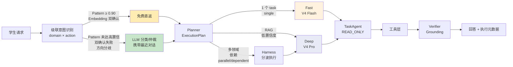
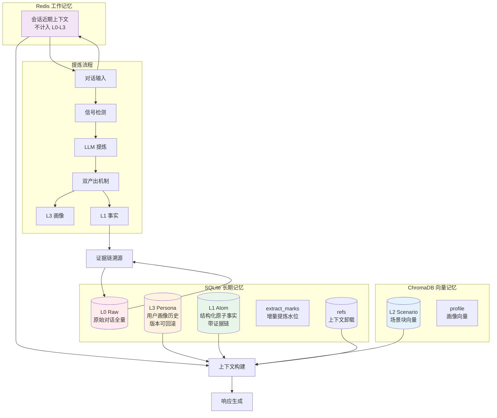
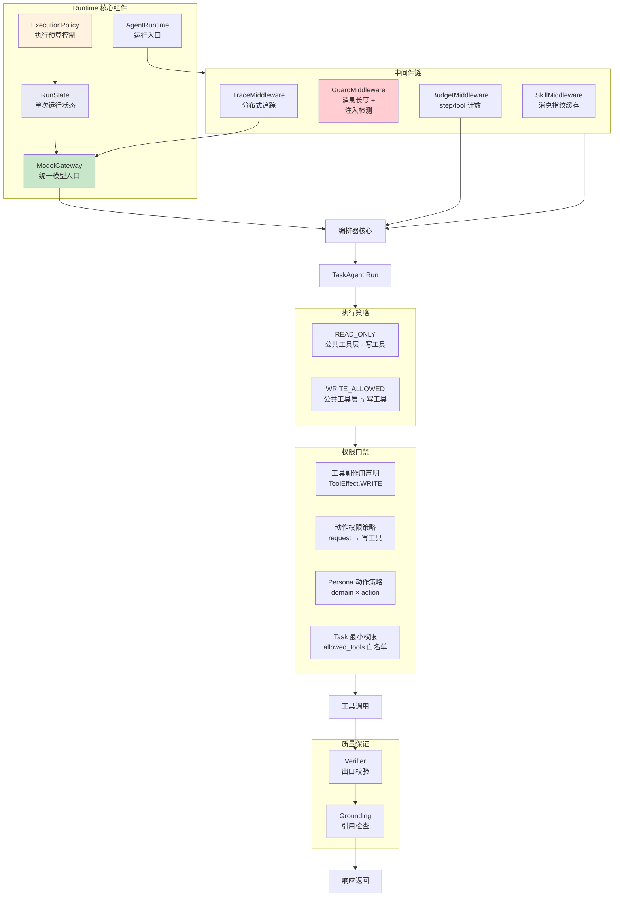
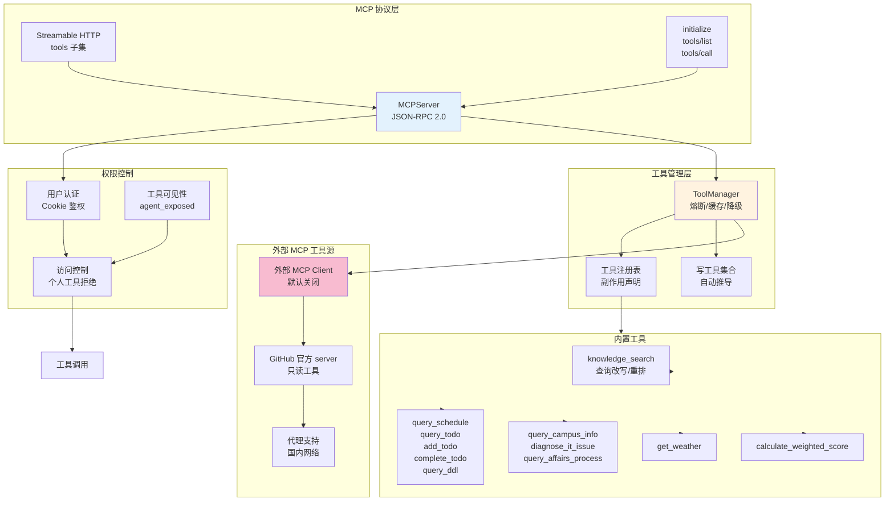

# EchoGuide 技术架构图

本文档包含 EchoGuide 系统的核心架构设计图，展示各组件之间的关系和数据流向。

## 目录

1. [系统整体架构](#系统整体架构)
2. [Fast/Deep 双路径架构](#fastdeep-双路径架构)
3. [分层长程记忆架构](#分层长程记忆架构)
4. [Agentic RAG 架构](#agentic-rag-架构)
5. [执行时 Runtime 架构](#执行时-runtime-架构)
6. [MCP Server 架构](#mcp-server-架构)

---

## 系统整体架构

```mermaid
flowchart TB
    subgraph "前端层"
        UI[Vue3 学生界面]
        Chat[对话交互]
        Monitor[监控面板]
    end

    subgraph "API 层 (FastAPI)"
        ChatAPI[/chat, /chat/stream]
        PersonalAPI[/personal/*]
        KnowledgeAPI[/knowledge/*]
        MonitorAPI[/monitor, /metrics]
        MCPAPI[/mcp]
        AuthAPI[/auth/*]
        SystemAPI[/health, /skills]
    end

    subgraph "Runtime 层 (Harness)"
        Orchestrator[编排器<br/>Task DAG 执行]
        TaskAgent[TaskAgent<br/>唯一执行体]
        Intent[级联意图识别]
        Planner[Planner<br/>ExecutionPlan]
        Profile[Profile<br/>Fast/Deep]
    end

    subgraph "记忆层"
        Redis[Redis<br/>工作记忆]
        SQLite[(SQLite<br/>L0/L1/L3)]
        Chroma[(ChromaDB<br/>L2/向量)]
    end

    subgraph "知识层"
        KB[知识库<br/>文档分块]
        Embedding[BGE Embedding<br/>本地推理]
        Rerank[BGE Reranker<br/>本地重排]
    end

    subgraph "工具层"
        Tools[工具管理器<br/>熔断/缓存/降级]
        PersonalTools[个人工具]
        CampusTools[校园工具]
        KnowledgeTools[知识检索工具]
    end

    subgraph "可观测层"
        Tracing[分布式追踪<br/>X-Trace-Id]
        Prometheus[Prometheus 指标]
        MonitorService[监控服务<br/>异常检测]
    end

    subgraph "外部服务"
        DeepSeek[DeepSeek API<br/>V4 Flash/Pro]
        QWeather[和风天气<br/>Open-Meteo 兜底]
    end

    UI --> ChatAPI
    Monitor --> MonitorAPI

    ChatAPI --> Orchestrator
    PersonalAPI --> PersonalTools
    KnowledgeAPI --> KB
    MCPAPI --> Tools
    AuthAPI --> SystemAPI

    Orchestrator --> Intent
    Intent --> Planner
    Planner --> Profile
    Profile --> TaskAgent

    TaskAgent --> Redis
    TaskAgent --> SQLite
    TaskAgent --> Chroma
    TaskAgent --> Tools
    TaskAgent --> KB
    TaskAgent --> DeepSeek

    Tools --> PersonalTools
    Tools --> CampusTools
    Tools --> KnowledgeTools

    KnowledgeTools --> Embedding
    KnowledgeTools --> Rerank

    Orchestrator --> Tracing
    Tools --> Prometheus
    TaskAgent --> MonitorService

    CampusTools --> QWeather

    style Orchestrator fill:#e1f5ff
    style TaskAgent fill:#fff4e1
    style Intent fill:#e8f5e9
    style Planner fill:#f3e5f5
    style Profile fill:#fce4ec
```

---

## Fast/Deep 双路径架构



**核心设计原则：**

- **级联意图识别**：Pattern 匹配优先，LLM 兜底，双确认机制
- **最小权限原则**：Fast 路径只读，Deep 路径允许写操作
- **成本控制**：Fast 路径无思考模式，Token 预算 768
- **复杂任务路由**：多任务依赖时自动升级 Deep

---

## 分层长程记忆架构



**记忆层级职责：**

| 层级 | 内容 | 存储 | 写入时机 |
|------|------|------|----------|
| Redis | 会话近期上下文 | Redis | 每轮对话 |
| L0 | 原始对话全量 | SQLite `raw_messages` | 每条消息 |
| L1 | 原子事实 + 证据链 | SQLite `facts` | 信号触发时 |
| L2 | 场景块向量 | ChromaDB `layer=scenario` | 记忆压缩时 |
| L3 | 用户画像历史 | ChromaDB + SQLite | 信号触发时 |

**核心特性：**

- **增量提炼**：`extract_marks` 水位记录，只提炼新消息
- **证据链溯源**：任意高层结论可下钻到 L0 原文
- **上下文卸载**：长工具结果落 `refs`，上下文只留摘要
- **一次双产出**：画像 + 事实零额外成本

---

## Agentic RAG 架构

```mermaid
flowchart TB
    Query[用户查询] --> Rewrite[查询改写<br/>LLM 扩写多角度子查询]

    Rewrite --> 并行召回[并行召回<br/>Top-K]
    并行召回 --> 向量搜索[ChromaDB 向量搜索<br/>BGE Embedding]

    向量搜索 --> 去重[去重]
    去重 --> 重排[重排<br/>BGE Reranker<br/>毫秒级本地]
    重排 -->|min_signal ≥ 0.7| LLM兜底[LLM 兜底重排]
    重排 -->|无判别信号| 保持顺序[保持召回顺序]

    LLM兜底 --> TopK[Top-K 结果]
    保持顺序 --> TopK

    TopK --> Agent[Agent 工具调用]
    Agent --> 引用链路[Grounding 链路<br/>retrieval-first +<br/>sentence-level citation]

    引用链路 --> 证据注入[证据注入<br/>编号证据 [i]]
    证据注入 --> 回答生成[回答生成]

    回答生成 --> 引用检查[引用正确性检查<br/>Dice + BGE 余弦]
    引用检查 --> 最终回答[最终回答 + 可核验来源]

    style Rewrite fill:#c8e6c9
    style 向量搜索 fill:#bbdefb
    style 重排 fill:#ffecb3
    style LLM兜底 fill:#fff3e0
    style 引用链路 fill:#f8bbd0
```

**RAG 优化链路：**

1. **查询改写**：LLM 扩写成多角度子查询
2. **并行召回**：ChromaDB 向量搜索，BGE Embedding 本地推理
3. **重排序**：BGE Reranker cross-encoder 毫秒级，无信号时保持原序
4. **Grounding**：检索优先，句级引用，证据链完整

---

## 执行时 Runtime 架构



**Runtime 核心组件：**

- **RunState**：单次运行状态、trace_id、计数器、错误记录
- **ExecutionPolicy**：协作目标上限、工具轮次分级、无进展检测
- **ModelGateway**：统一 LLM 调用入口，Token 统计、降级次数
- **AgentRuntime**：运行入口、中间件链编排

**四层权限门禁：**

1. **注册级**：`Tool.effect` 副作用声明
2. **Run 级**：非 request 动作一律 READ_ONLY
3. **Action 级**：动作类型权限过滤
4. **Task 级**：任务最小权限白名单

---

## MCP Server 架构



**MCP 协议特性：**

- **Streamable HTTP**：JSON-RPC 2.0 标准，SSE 支持
- **工具 Schema 映射**：JSON Schema ↔ MCP inputSchema
- **权限控制**：登录用户才能访问个人工具
- **外部工具源**：可选集成远程 MCP server
- **前缀隔离**：外部工具 `github_*` 前缀避免冲突

---

## 总结

EchoGuide 的核心架构优势：

1. **分层长程记忆**：L0-L3 四层记忆，证据链完整溯源
2. **Fast/Deep 双路径**：成本与质量的最优平衡
3. **级联意图识别**：Pattern + Embedding 双确认 + LLM 兜底
4. **Agentic RAG**：本地向量模型，完整的检索优化链路
5. **Runtime Harness**：统一执行控制，四层权限门禁
6. **MCP 标准协议**：工具生态扩展，可选外部工具源

所有设计都遵循"宁紧勿松"的安全原则，在保证功能完整性的前提下，最大限度降低误判风险。