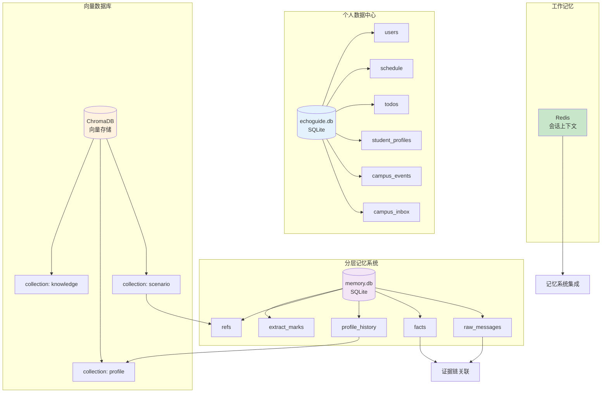
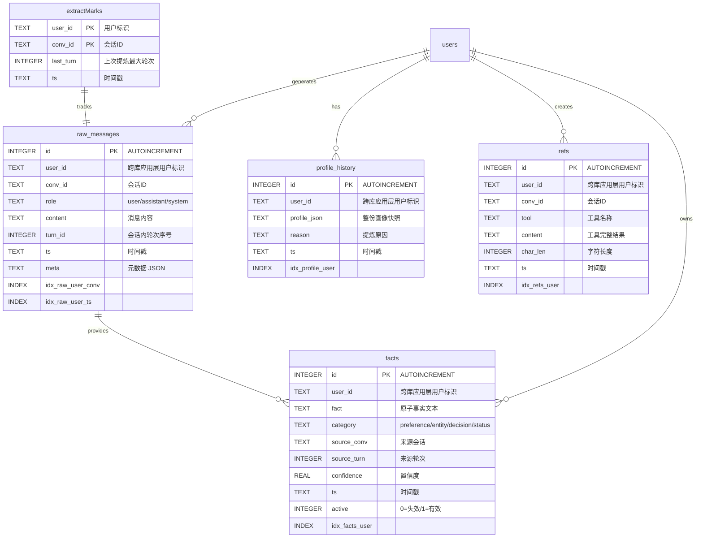
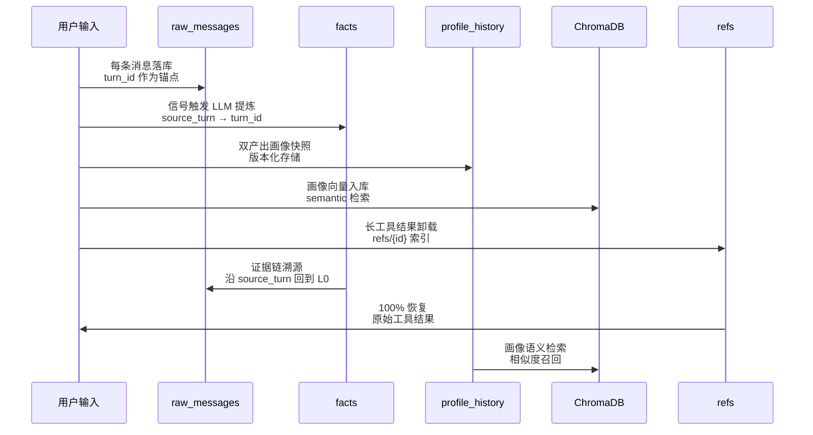
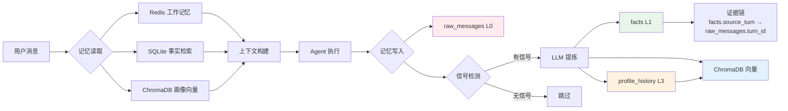
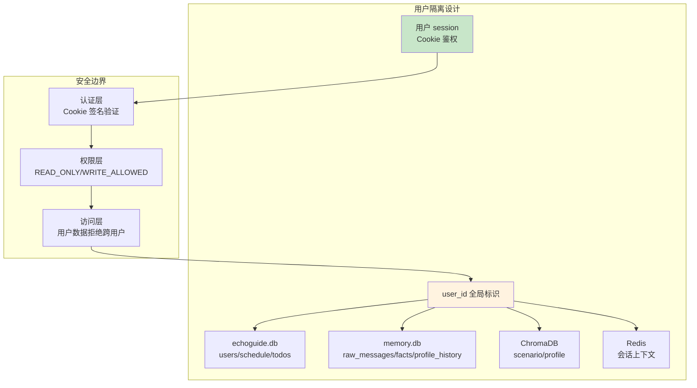

# XGuide 数据库 ER 图

本文档展示 XGuide 系统中所有数据库的实体关系设计，包括个人数据、Campus Radar、分层记忆和向量数据库。

## 目录

1. [数据存储架构概览](#数据存储架构概览)
2. [个人数据中心与 Campus Radar (echoguide.db)](#个人数据中心与-campus-radar-echoguidedb)
3. [分层长程记忆 (memory.db)](#分层长程记忆-memorydb)
4. [ChromaDB 向量数据库](#chromadb-向量数据库)
5. [数据流向与关联关系](#数据流向与关联关系)

---

## 数据存储架构概览



---

## 个人数据中心与 Campus Radar (echoguide.db)

个人数据中心存储用户认证信息和个人数据，全部按 `user_id` 隔离。

### ER 图

```mermaid
erDiagram
    users ||--o{ schedule : owns
    users ||--o{ todos : owns
    users ||--|| student_profiles : owns
    users ||--o{ campus_inbox : owns
    campus_events ||--o{ campus_inbox : appears_in
    campus_events ||--o{ todos : sources

    users {
        INTEGER id PK "AUTOINCREMENT"
        TEXT username UK NOCASE "用户名"
        TEXT password_hash "密码哈希"
        TEXT role "user/admin"
        INTEGER pwd_ver "密码版本"
        TEXT created_at "创建时间"
    }

    schedule {
        TEXT user_id "应用层关联 users.id"
        TEXT course "课程名称"
        INTEGER day_of_week "0=周一...6=周日"
        TEXT start_time "开始时间 HH:MM"
        TEXT end_time "结束时间 HH:MM"
        TEXT location "上课地点"
        TEXT weeks "教学周列表 1,3,5-8"
        TEXT note "备注"
    }

    todos {
        INTEGER id PK "AUTOINCREMENT"
        TEXT user_id "应用层关联 users.id"
        TEXT content "事项内容"
        TEXT kind "todo/ddl/exam"
        TEXT due_at "截止时间 YYYY-MM-DD HH:MM"
        INTEGER done "0=未完成/1=完成"
        TEXT created_at "创建时间"
        TEXT completed_at "完成时间"
        INTEGER source_event_id "应用层关联 campus_events.id，可为空"
        TEXT source_url "来源原文 URL"
        TEXT source_deadline "原始截止日期"
        TEXT action_plan_id "同一行动计划标识"
    }

    student_profiles {
        TEXT user_id PK "用户标识"
        TEXT college "学院"
        TEXT major "专业"
        TEXT grade "年级/届别"
        TEXT education "本科生/研究生"
        TEXT interests_json "关注方向 JSON 数组"
        TEXT updated_at "更新时间"
    }

    campus_events {
        INTEGER id PK "事件 ID"
        TEXT fingerprint UK "来源 URL 指纹"
        TEXT title "通知标题"
        TEXT summary "摘要"
        TEXT body "清洗后的正文"
        TEXT source_name "来源名称"
        TEXT source_category "来源类别"
        TEXT source_url "官方原文 URL"
        TEXT published_at "发布日期"
        TEXT deadline "原文提取的截止日期"
        TEXT targets_json "目标人群 JSON 数组"
        TEXT requirements_json "条件 JSON 数组"
        TEXT materials_json "材料 JSON 数组"
        TEXT actions_json "动作 JSON 数组"
        TEXT location "地点"
        TEXT event_type "事件类型"
        TEXT content_hash "正文内容哈希"
        TEXT etag "HTTP ETag"
        TEXT last_modified "HTTP Last-Modified"
        TEXT fetched_at "首次抓取时间"
        TEXT last_checked_at "最近检查时间"
        TEXT updated_at "内容更新时间"
    }

    campus_inbox {
        TEXT user_id PK "用户标识（联合主键，应用层关联 users.id）"
        INTEGER event_id PK "事件 ID（联合主键，应用层关联 campus_events.id）"
        INTEGER relevance "相关性分数"
        TEXT reason "推荐原因"
        TEXT status "new/seen/interested/ignored/deleted"
        TEXT expires_at "个人 Inbox 投递过期时间"
        TEXT updated_at "更新时间"
    }

    users {
        INDEX idx_schedule_user
        INDEX idx_todos_user
    }
```

> 图中的用户、来源事件关系是**应用层逻辑关联**。当前 SQLite DDL 没有声明 `FOREIGN KEY` 约束；数据归属和引用有效性由认证依赖、Service/Store 查询条件与测试共同保证。

### 表结构详情

#### users 表 (用户认证)

| 字段 | 类型 | 约束 | 说明 |
|------|------|------|------|
| id | INTEGER | PRIMARY KEY AUTOINCREMENT | 自增主键 |
| username | TEXT | UNIQUE NOCASE | 用户名，不区分大小写 |
| password_hash | TEXT | NOT NULL | bcrypt 密码哈希 |
| role | TEXT | DEFAULT 'user' | 用户角色：user/admin |
| pwd_ver | INTEGER | DEFAULT 0 | 密码版本，用于密码重置 |
| created_at | TEXT | DEFAULT CURRENT_TIMESTAMP | 账号创建时间 |

**索引**：
- `username UNIQUE NOCASE`：确保用户名唯一，不区分大小写

#### schedule 表 (课程表)

| 字段 | 类型 | 约束 | 说明 |
|------|------|------|------|
| user_id | TEXT | NOT NULL, FK→users | 用户标识 |
| course | TEXT | NOT NULL | 课程名称 |
| day_of_week | INTEGER | NOT NULL | 0=周一...6=周日 |
| start_time | TEXT | NOT NULL | 开始时间，格式 "HH:MM" |
| end_time | TEXT | NOT NULL | 结束时间，格式 "HH:MM" |
| location | TEXT | DEFAULT '' | 上课地点 |
| weeks | TEXT | DEFAULT '' | 教学周列表，如 "1,3,5-8" |
| note | TEXT | DEFAULT '' | 备注信息 |

**索引**：
- `idx_schedule_user(user_id)`：按用户查询课程表

**业务逻辑**：
- 整表替换：导入新课表时先清空该用户旧数据
- 周视图：按 `day_of_week, start_time` 排序展示本周课程

#### todos 表 (待办/DDL/考试)

| 字段 | 类型 | 约束 | 说明 |
|------|------|------|------|
| id | INTEGER | PRIMARY KEY AUTOINCREMENT | 自增主键 |
| user_id | TEXT | NOT NULL, FK→users | 用户标识 |
| content | TEXT | NOT NULL | 事项内容 |
| kind | TEXT | DEFAULT 'todo' | 类型：todo/ddl/exam |
| due_at | TEXT | NULL | 截止时间，格式 "YYYY-MM-DD" 或 "YYYY-MM-DD HH:MM" |
| done | INTEGER | DEFAULT 0 | 0=未完成，1=已完成 |
| created_at | TEXT | NOT NULL | 创建时间 |
| completed_at | TEXT | NULL | 完成时间 |
| source_event_id | INTEGER | NULL | 由 Inbox 行动计划创建时关联的 `campus_events.id` |
| source_url | TEXT | NULL | 可回到官方原文的来源链接 |
| source_deadline | TEXT | NULL | 原始通知中的截止日期，避免由系统推测 |
| action_plan_id | TEXT | NULL | 同一次“加入个人计划”创建事项的分组标识 |

**索引**：
- `idx_todos_user(user_id)`：按用户查询待办

**业务逻辑**：
- 支持按状态筛选：open/done/all
- 支持按类型过滤：todo/ddl/exam
- 支持标记完成/恢复未完成
- 行动计划只从已结构化的公开通知生成；用户手工待办不必包含来源字段

#### student_profiles 表（通知筛选条件）

每个用户最多一行。学院、专业、年级、学历层次和关注方向用于**本地** Inbox 相关性排序，不会在对外抓取时发送给校园网站。

#### campus_events 与 campus_inbox 表（公开通知与个人收件箱）

`campus_events` 保存从无需登录的官方页面取得的通知、来源链接和可核验的结构化字段。`fingerprint` 保证同一来源链接不会重复写入；`content_hash`、`etag`、`last_modified` 支持增量同步和条件请求。

`campus_inbox` 是用户与公开事件的关联表，联合主键为 `(user_id, event_id)`。它保存当前相关性分数、推荐原因、用户状态和 `expires_at`；同一公开事件可出现在多个用户的 Inbox 中，忽略、删除和默认 48 小时投递期限彼此隔离，均不会删除公共事件。

---

## 分层长程记忆 (memory.db)

分层记忆系统实现 L0-L3 四层记忆架构，保留证据链，支持溯源。

### ER 图



### 表结构详情

#### raw_messages 表 (L0 原始对话)

| 字段 | 类型 | 约束 | 说明 |
|------|------|------|------|
| id | INTEGER | PRIMARY KEY AUTOINCREMENT | 自增主键 |
| user_id | TEXT | NOT NULL | 用户标识 |
| conv_id | TEXT | NOT NULL | 会话ID |
| role | TEXT | NOT NULL | 角色：user/assistant/system |
| content | TEXT | NOT NULL | 消息内容 |
| turn_id | INTEGER | NOT NULL | 会话内轮次序号 |
| ts | TEXT | NOT NULL | 时间戳 |
| meta | TEXT | DEFAULT '{}' | 元数据，JSON 格式 |

**索引**：
- `idx_raw_user_conv(user_id, conv_id, turn_id)`：证据链查询
- `idx_raw_user_ts(user_id, ts)`：时间范围查询

**设计要点**：
- 永久存储，不删除，保留证据
- `turn_id` 作为证据链锚点
- 支持 L1 事实溯源到原始对话

#### facts 表 (L1 结构化原子事实)

| 字段 | 类型 | 约束 | 说明 |
|------|------|------|------|
| id | INTEGER | PRIMARY KEY AUTOINCREMENT | 自增主键 |
| user_id | TEXT | NOT NULL | 用户标识 |
| fact | TEXT | NOT NULL | 原子事实文本 |
| category | TEXT | DEFAULT 'preference' | 类别：preference/entity/decision/status |
| source_conv | TEXT | DEFAULT '' | 来源会话ID |
| source_turn | INTEGER | DEFAULT 0 | 来源轮次 |
| confidence | REAL | DEFAULT 1.0 | 置信度 0.0-1.0 |
| ts | TEXT | NOT NULL | 时间戳 |
| active | INTEGER | DEFAULT 1 | 0=失效，1=有效 |

**索引**：
- `idx_facts_user(user_id, category)`：按用户和类别查询

**设计要点**：
- 证据链：`source_conv + source_turn` → `raw_messages.turn_id`
- 去重逻辑：被画像覆盖的事实不落 L1
- 失效标记：软删除，保留历史记录
- 按需召回：共享非停用字符 bigram 匹配

#### profile_history 表 (L3 用户画像历史)

| 字段 | 类型 | 约束 | 说明 |
|------|------|------|------|
| id | INTEGER | PRIMARY KEY AUTOINCREMENT | 自增主键 |
| user_id | TEXT | NOT NULL | 用户标识 |
| profile_json | TEXT | NOT NULL | 整份画像快照，JSON 格式 |
| reason | TEXT | DEFAULT '' | 提炼原因 |
| ts | TEXT | NOT NULL | 时间戳 |

**索引**：
- `idx_profile_user(user_id)`：按用户查询画像历史

**设计要点**：
- 版本化存储：每条都是完整画像快照
- 可回滚：支持回滚到任意历史版本
- ChromaDB 向量化：用于语义检索
- SQLite 持久化：支持时间范围查询

#### refs 表 (上下文卸载)

| 字段 | 类型 | 约束 | 说明 |
|------|------|------|------|
| id | INTEGER | PRIMARY KEY AUTOINCREMENT | 自增主键 |
| user_id | TEXT | NOT NULL | 用户标识 |
| conv_id | TEXT | DEFAULT '' | 会话ID |
| tool | TEXT | DEFAULT '' | 工具名称 |
| content | TEXT | NOT NULL | 工具完整结果 |
| char_len | INTEGER | DEFAULT 0 | 字符长度 |
| ts | TEXT | NOT NULL | 时间戳 |

**索引**：
- `idx_refs_user(user_id)`：按用户查询卸载内容

**设计要点**：
- 上下文卸载：工具结果超过 1500 字符时落盘
- 摘要保留：上下文只留摘要 + `refs/{id}` 索引
- 完整找回：100% 恢复原始工具结果

#### extract_marks 表 (增量提炼水位)

| 字段 | 类型 | 约束 | 说明 |
|------|------|------|------|
| user_id | TEXT | PRIMARY KEY | 用户标识 |
| conv_id | TEXT | PRIMARY KEY | 会话ID |
| last_turn | INTEGER | DEFAULT 0 | 上次提炼最大轮次 |
| ts | TEXT | NOT NULL | 时间戳 |

**设计要点**：
- 复合主键：`(user_id, conv_id)` 唯一标识
- 增量提炼：记录水位，只提炼新消息
- 串行化：同会话并发提炼串行执行

---

## ChromaDB 向量数据库

ChromaDB 存储结构化数据的向量化表示，支持语义检索和相似度搜索。

### Collections 结构

#### knowledge Collection (知识库)

```python
{
    "ids": ["chunk_0", "chunk_1", ...],
    "documents": ["文档分块内容...", ...],
    "metadatas": [
        {
            "title": "文档标题",
            "domain": "academic/campus_life/affairs/it_help/general",
            "source_url": "来源URL",
            "updated_at": "更新时间",
            "valid_from": "生效时间",
            "source_status": "official/unverified/sample/stale",
        },
        ...,
    ],
}
```

**分块策略**：
- Markdown 结构感知：标题链注入块首，表格/代码块整体保留
- 分块大小：500 字，60 字符重叠
- 支持格式：txt/md/json/jsonl/Firecrawl anydoc 统一转 GFM Markdown

#### scenario Collection (L2 场景记忆)

```python
{
    "ids": ["scenario_user1_conv1_0", ...],
    "documents": ["场景块内容...", ...],
    "metadatas": [
        {
            "user_id": "用户标识",
            "conv_id": "会话ID",
            "layer": "scenario",
            "ts": "时间戳",
            "kind": "task/conclusion/entity",
        },
        ...,
    ],
}
```

**设计要点**：
- 工作记忆压缩时生成
- 检索优先注入上下文
- 按用户和会话隔离

#### profile Collection (L3 用户画像向量)

```python
{
    "ids": ["profile_user1_v3", ...],
    "documents": ["画像JSON字符串...", ...],
    "metadatas": [{"user_id": "用户标识", "version": "版本号", "layer": "profile", "ts": "时间戳"}, ...],
}
```

**设计要点**：
- 版本化存储：每次画像更新新增向量
- 常驻注入：L3 画像常驻上下文
- 语义检索：支持画像相似度查询

### 向量模型

| 层级 | 模型 | 维度 | 用途 |
|------|------|------|------|
| knowledge | BGE-small-zh-v1.5 (ONNX) | 512 | 知识库检索 |
| scenario | BGE-small-zh-v1.5 (ONNX) | 512 | 场景记忆检索 |
| profile | BGE-small-zh-v1.5 (ONNX) | 512 | 画像语义检索 |

**降级策略**：
- BGE 不可用 → ChromaDB 内置 MiniLM-L6-v2 (384 维)
- 空间切换：collection 名随模型变化，不混存

---

## 数据流向与关联关系

### 证据链完整流向



### 记忆系统集成流程



### 用户数据隔离架构



**隔离保证**：
- 认证层：Cookie JWT 签名验证，生产环境强制 SECRET_KEY
- 权限层：动作类型过滤工具访问
- 访问层：所有查询带 `user_id` WHERE 条件

---

## 性能优化策略

### 索引优化

| 表 | 索引 | 查询模式 | 性能提升 |
|---|------|----------|----------|
| raw_messages | (user_id, conv_id, turn_id) | 证据链查询 | O(log n) |
| raw_messages | (user_id, ts) | 时间范围查询 | O(log n) |
| facts | (user_id, category) | 类别过滤 | O(log n) |
| schedule | (user_id) | 用户课表查询 | O(log n) |
| todos | (user_id) | 用户待办查询 | O(log n) |

### 上下文卸载

- **阈值**：工具结果 > 1500 字符自动卸载
- **Token 节省**：实测节省 93.6% Token
- **完整恢复**：100% 找回原始结果
- **透明性**：Agent 无感知，自动摘要 + 索引

### 增量提炼

- **水位机制**：`extract_marks` 记录 `last_turn`
- **避免重复**：只提炼新消息，老消息不重复喂 LLM
- **串行化**：同会话并发提炼串行执行
- **零额外成本**：画像 + 事实双产出

---

## 数据治理策略

### 版本化管理

- **画像回滚**：`profile_history` 支持回滚到任意版本
- **失效标记**：事实软删除，保留历史记录
- **证据链完整**：高层结论 → 事实 → 原文可溯源

### 生命周期管理

- **临时文件**：Git 忽略，定期清理
- **日志轮转**：按时间/大小归档
- **评测结果**：不入库，可重新生成

### 安全治理

- **权限隔离**：`user_id` 全局隔离
- **动作门禁**：`query` 只读，`request` 写操作
- **工具副作用**：`ToolEffect.WRITE` 自动推导写工具

---

## 总结

EchoGuide 的数据架构设计遵循以下原则：

1. **分层存储**：Redis 工作记忆 + SQLite 结构化 + ChromaDB 向量化
2. **证据链完整**：L0-L3 可溯源，任意高层结论可下钻到原始对话
3. **性能优化**：索引覆盖、上下文卸载、增量提炼
4. **安全隔离**：用户数据完全隔离，权限门禁严格
5. **可扩展性**：ChromaDB 支持水平扩展，向量模型可替换

所有设计都围绕"白盒可溯源"和"性能可控"两大核心目标。
